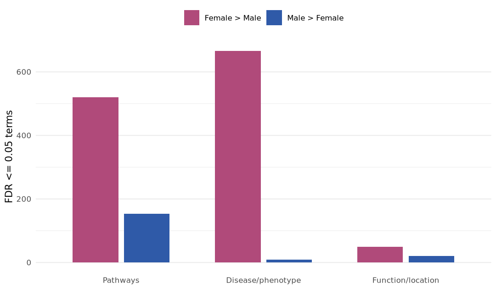
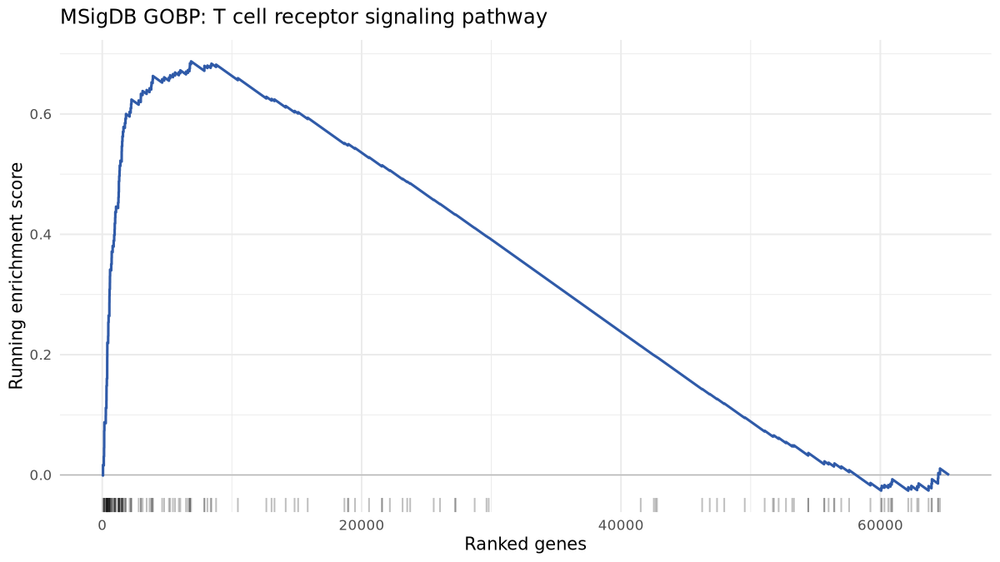
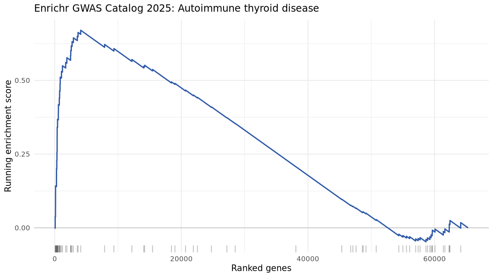

# GTEx Thyroid Sex Contrast

GTEx v11 thyroid samples were contrasted by sex using DESeq2 on raw counts, adjusting for age group, Hardy death class, RNA integrity, tissue ischemic time, and sequencing center. Genes were ranked by the Wald statistic for Female vs Male and tested against three ALIEN GTEx/Gencode GMT collections with multilevel rsfgsea: pathways, disease/phenotype, and function/location. Cancer dependency is intentionally not used for GTEx.

- Samples: 683 total (224 Female, 459 Male).
- Ranked genes: 65295.
- DESeq2 design: `~ AGE + DTHHRDY + SMRIN + SMTSISCH + SMCENTER + sex`.
- GMT files under `results/alien_outputs`: `pathways/gmt/gtex_v11_gencode47.gmt`, `disease_phenotype/gmt/gtex_v11_gencode47.gmt`, `function_location/gmt/gtex_v11_gencode47.gmt`.
- rsfgsea: `rsfgsea` in multilevel mode.
- Direction: positive NES means Female > Male; negative NES means Male > Female.

## Main Result

FDR-significant enrichment was present in 3 of 3 collections. The broadest signal was in `Disease/phenotype` (666 Female > Male terms, 9 Male > Female terms), with the larger directional count in Female > Male sets.

## Data Products

- DESeq2 table: [gtex_thyroid_female_vs_male_deseq2.tsv](../../../results/sex_contrast/gtex_thyroid/tables/gtex_thyroid_female_vs_male_deseq2.tsv)
- Rank file: [gtex_thyroid_female_vs_male.ranks.tsv](../../../results/sex_contrast/gtex_thyroid/ranks/gtex_thyroid_female_vs_male.ranks.tsv)

## Collection Summary

The figure below gives a collection-level view of significant enrichment. Detailed term-level results are shown in the tables; figures are limited to the clearest thyroid immune and autoimmune examples.

Collection | Tested terms | FDR <= 0.05 | Strongest Female > Male | Strongest Male > Female
--- | --- | --- | --- | ---
Pathways | 7716 | 673 | GOBP: T cell receptor signaling pathway (NES 2.33, FDR 0.0318) | GOBP: Regulation of androgen receptor signaling pathway (NES -2.33, FDR 0.0318)
Disease/phenotype | 11886 | 675 | HPO: Abnormal T cell morphology (NES 2.28, FDR 0.0338) | HPO: Decreased testicular size (NES -2.02, FDR 0.0338)
Function/location | 1825 | 71 | GOCC: Tertiary granule (NES 1.75, FDR 0.0127) | GOMF: Dynein heavy chain binding (NES -2.01, FDR 0.0226)

## Enrichment Results

### Pathways

- GMT: `results/alien_outputs/pathways/gmt/gtex_v11_gencode47.gmt`.
- rsfgsea table: [gtex_thyroid_pathways_female_vs_male_rsfgsea.tsv](../../../results/sex_contrast/gtex_thyroid/tables/gtex_thyroid_pathways_female_vs_male_rsfgsea.tsv)
- Tested 7716 terms; 673 had FDR <= 0.05.
- Strongest Female > Male signal: GOBP: T cell receptor signaling pathway (NES 2.33, FDR 0.0318).
- Strongest Male > Female signal: GOBP: Regulation of androgen receptor signaling pathway (NES -2.33, FDR 0.0318).

Top enrichment rows:

Source | Collection | Term | NES | P value | FDR | Genes
--- | --- | --- | --- | --- | --- | ---
MSigDB | GOBP | Regulation of androgen receptor signaling pathway | -2.333 | 0.001556 | 0.03178 | 33
MSigDB | GOBP | T cell receptor signaling pathway | 2.328 | 0.001441 | 0.03178 | 161
MSigDB | GOBP | Antigen receptor mediated signaling pathway | 2.323 | 0.001406 | 0.03178 | 220
MSigDB | GOBP | Natural killer cell mediated immunity | 2.312 | 0.001449 | 0.03178 | 94
MSigDB | Reactome | Sars cov 1 modulates host translation machinery | -2.309 | 0.0008006 | 0.03178 | 37
MSigDB | GOBP | Leukocyte mediated cytotoxicity | 2.305 | 0.001441 | 0.03178 | 156
MSigDB | GOBP | Regulation of natural killer cell mediated immunity | 2.24 | 0.001515 | 0.03178 | 61
MSigDB | Reactome | Generation of second messenger molecules | 2.223 | 0.00155 | 0.03178 | 37

Selected figure:

### Disease/phenotype

- GMT: `results/alien_outputs/disease_phenotype/gmt/gtex_v11_gencode47.gmt`.
- rsfgsea table: [gtex_thyroid_disease_phenotype_female_vs_male_rsfgsea.tsv](../../../results/sex_contrast/gtex_thyroid/tables/gtex_thyroid_disease_phenotype_female_vs_male_rsfgsea.tsv)
- Tested 11886 terms; 675 had FDR <= 0.05.
- Strongest Female > Male signal: HPO: Abnormal T cell morphology (NES 2.28, FDR 0.0338).
- Strongest Male > Female signal: HPO: Decreased testicular size (NES -2.02, FDR 0.0338).

Top enrichment rows:

Source | Collection | Term | NES | P value | FDR | Genes
--- | --- | --- | --- | --- | --- | ---
MSigDB | HPO | Abnormal T cell morphology | 2.28 | 0.00149 | 0.03381 | 133
MSigDB | HPO | Abnormal T cell subset distribution | 2.261 | 0.001546 | 0.03381 | 85
MSigDB | HPO | Abnormal B cell morphology | 2.248 | 0.001508 | 0.03381 | 112
MSigDB | HPO | Abnormal lymphocyte morphology | 2.161 | 0.001447 | 0.03381 | 263
MSigDB | HPO | Abnormal eosinophil morphology | 2.137 | 0.001529 | 0.03381 | 74
MSigDB | HPO | Abnormal circulating interleukin concentration | 2.131 | 0.001565 | 0.03381 | 38
MSigDB | HPO | Unusual fungal infection | 2.13 | 0.00152 | 0.03381 | 121
MSigDB | HPO | Meningitis | 2.127 | 0.001553 | 0.03381 | 80

Selected figure:

### Function/location

- GMT: `results/alien_outputs/function_location/gmt/gtex_v11_gencode47.gmt`.
- rsfgsea table: [gtex_thyroid_function_location_female_vs_male_rsfgsea.tsv](../../../results/sex_contrast/gtex_thyroid/tables/gtex_thyroid_function_location_female_vs_male_rsfgsea.tsv)
- Tested 1825 terms; 71 had FDR <= 0.05.
- Strongest Female > Male signal: GOCC: Tertiary granule (NES 1.75, FDR 0.0127).
- Strongest Male > Female signal: GOMF: Dynein heavy chain binding (NES -2.01, FDR 0.0226).

Top enrichment rows:

Source | Collection | Term | NES | P value | FDR | Genes
--- | --- | --- | --- | --- | --- | ---
MSigDB | GOCC | Tertiary granule | 1.753 | 6.96e-06 | 0.0127 | 163
MSigDB | GOMF | Dynein heavy chain binding | -2.014 | 0.0001795 | 0.02265 | 14
MSigDB | GOMF | G protein coupled chemoattractant receptor activity | 2.011 | 3.036e-05 | 0.02265 | 27
MSigDB | GOCC | Motile cilium | -2.001 | 0.0001393 | 0.02265 | 331
MSigDB | GOMF | Immunoglobulin binding | 1.988 | 0.0002343 | 0.02265 | 30
MSigDB | GOCC | MHC protein complex | 1.955 | 0.0002358 | 0.02265 | 24
MSigDB | GOMF | Igg binding | 1.871 | 6.307e-05 | 0.02265 | 14
MSigDB | GOMF | Immunoglobulin receptor activity | 1.85 | 6.307e-05 | 0.02265 | 14

