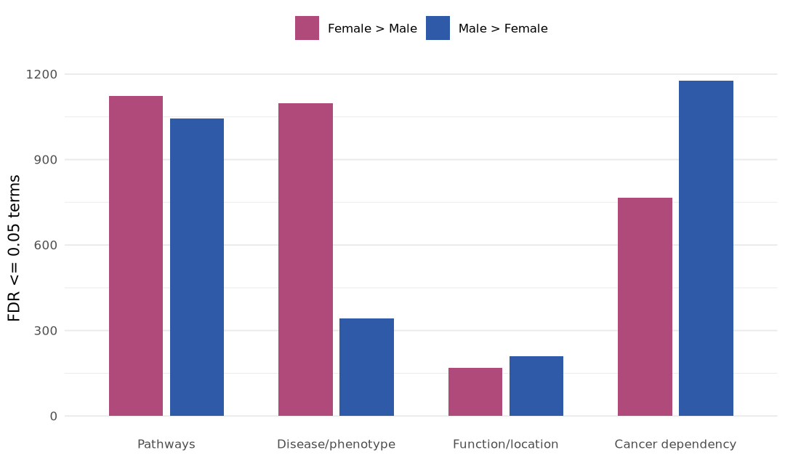
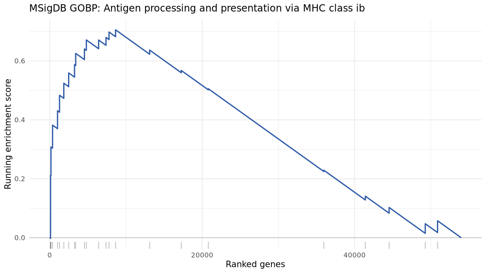
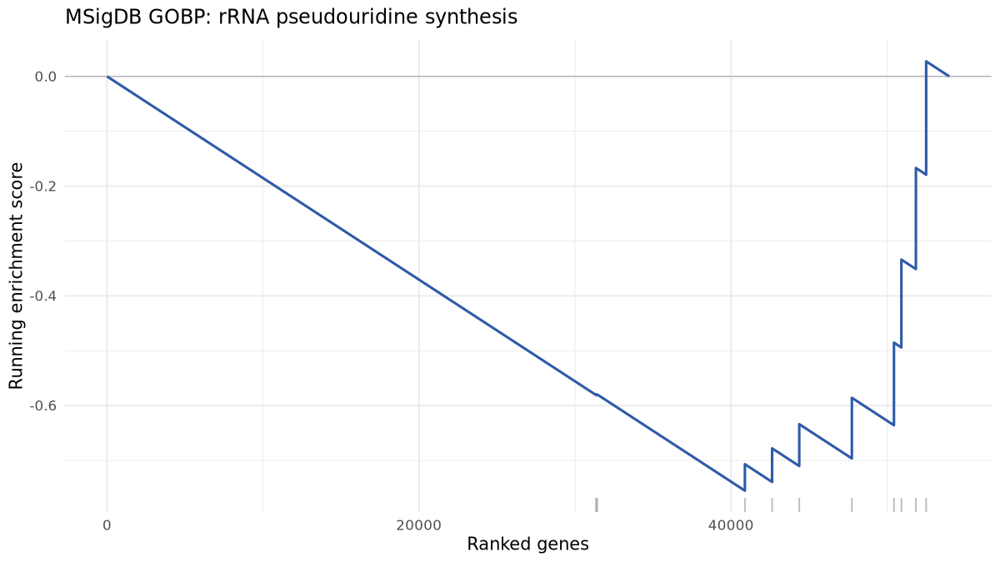
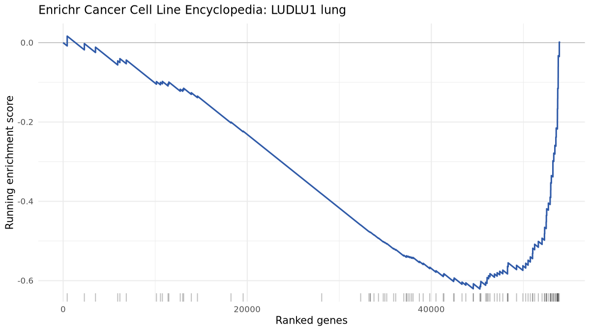

# TCGA Lung Cancer Sex Contrast

TCGA LUAD and LUSC primary tumors from recount3 were contrasted by sex using DESeq2 on raw counts, adjusting for cancer project and age at diagnosis. Genes were ranked by the Wald statistic for Female vs Male and tested against all four ALIEN TCGA GMT collections with multilevel rsfgsea.

- Projects: LUAD, LUSC.
- Sample type: Primary Tumor.
- Samples: 998 total (404 Female, 594 Male).
- Ranked genes: 53984.
- DESeq2 design: `~ project + age_at_diagnosis + sex`.
- GMT files under `results/alien_outputs`: `pathways/gmt/tcga_recount3_gencode29.gmt`, `disease_phenotype/gmt/tcga_recount3_gencode29.gmt`, `function_location/gmt/tcga_recount3_gencode29.gmt`, `cancer_dependency/gmt/tcga_recount3_gencode29.gmt`.
- rsfgsea: `rsfgsea` in multilevel mode.
- Direction: positive NES means Female > Male; negative NES means Male > Female.

## Main Result

FDR-significant enrichment was present in 4 of 4 collections. The broadest signal was in `Pathways` (1124 Female > Male terms, 1044 Male > Female terms), with the larger directional count in Female > Male sets.

## Data Products

- DESeq2 table: [tcga_lung_female_vs_male_deseq2.tsv](../../../results/sex_contrast/tcga_lung/tables/tcga_lung_female_vs_male_deseq2.tsv)
- Rank file: [tcga_lung_female_vs_male.ranks.tsv](../../../results/sex_contrast/tcga_lung/ranks/tcga_lung_female_vs_male.ranks.tsv)

## Collection Summary

The figure below gives a collection-level view of significant enrichment. Detailed term-level results are shown in the tables; figures are limited to the clearest pathway and cancer-dependency examples.

Collection | Tested terms | FDR <= 0.05 | Strongest Female > Male | Strongest Male > Female
--- | --- | --- | --- | ---
Pathways | 7771 | 2168 | GOBP: Negative regulation of interleukin 10 production (NES 1.91, FDR 0.0071) | GOBP: Farnesyl diphosphate biosynthetic process (NES -2.03, FDR 0.00305)
Disease/phenotype | 11902 | 1440 | DisGeNET: Autoimmune primary adrenal insufficiency (NES 2.35, FDR 0.024) | Clinvar 2025: Leigh syndrome (NES -1.97, FDR 0.024)
Function/location | 1835 | 377 | GOCC: T cell receptor complex (NES 2.6, FDR 0.0226) | GOMF: Nucleic acid conformation isomerase activity (NES -2.4, FDR 0.0226)
Cancer dependency | 2702 | 1942 | Cancer Cell Line Encyclopedia: HS611T haematopoietic and lymphoid tissue (NES 2.74, FDR 0.00454) | CGN: GNF2 CCNA2 (NES -2.7, FDR 0.00454)

## Enrichment Results

### Pathways

- GMT: `results/alien_outputs/pathways/gmt/tcga_recount3_gencode29.gmt`.
- rsfgsea table: [tcga_lung_pathways_female_vs_male_rsfgsea.tsv](../../../results/sex_contrast/tcga_lung/tables/tcga_lung_pathways_female_vs_male_rsfgsea.tsv)
- Tested 7771 terms; 2168 had FDR <= 0.05.
- Strongest Female > Male signal: GOBP: Negative regulation of interleukin 10 production (NES 1.91, FDR 0.0071).
- Strongest Male > Female signal: GOBP: Farnesyl diphosphate biosynthetic process (NES -2.03, FDR 0.00305).

Top enrichment rows:

Source | Collection | Term | NES | P value | FDR | Genes
--- | --- | --- | --- | --- | --- | ---
MSigDB | GOBP | Farnesyl diphosphate biosynthetic process | -2.034 | 1.098e-05 | 0.003049 | 10
MSigDB | KEGG Medicus | Reference recruitment and formation of the mcc | -1.904 | 1.098e-05 | 0.003049 | 10
MSigDB | GOBP | Positive regulation of protein localization to cajal body | -1.872 | 1.098e-05 | 0.003049 | 10
MSigDB | GOBP | mRNA pseudouridine synthesis | -1.817 | 1.098e-05 | 0.003049 | 10
MSigDB | KEGG Medicus | Reference citrate cycle second carbon oxidation 2 | -1.783 | 1.098e-05 | 0.003049 | 10
MSigDB | Reactome | Cholesterol biosynthesis via desmosterol bloch pathway | -1.782 | 1.098e-05 | 0.003049 | 10
MSigDB | GOBP | Heme a biosynthetic process | -1.78 | 1.098e-05 | 0.003049 | 10
MSigDB | GOBP | Regulation of amino acid metabolic process | -1.77 | 1.098e-05 | 0.003049 | 10

Selected figures:

### Disease/phenotype

- GMT: `results/alien_outputs/disease_phenotype/gmt/tcga_recount3_gencode29.gmt`.
- rsfgsea table: [tcga_lung_disease_phenotype_female_vs_male_rsfgsea.tsv](../../../results/sex_contrast/tcga_lung/tables/tcga_lung_disease_phenotype_female_vs_male_rsfgsea.tsv)
- Tested 11902 terms; 1440 had FDR <= 0.05.
- Strongest Female > Male signal: DisGeNET: Autoimmune primary adrenal insufficiency (NES 2.35, FDR 0.024).
- Strongest Male > Female signal: Clinvar 2025: Leigh syndrome (NES -1.97, FDR 0.024).

Top enrichment rows:

Source | Collection | Term | NES | P value | FDR | Genes
--- | --- | --- | --- | --- | --- | ---
Enrichr | DisGeNET | Autoimmune primary adrenal insufficiency | 2.35 | 0.001727 | 0.02401 | 47
MSigDB | HPO | Meningitis | 2.278 | 0.001695 | 0.02401 | 80
MSigDB | HPO | Recurrent mycobacterial infections | 2.243 | 0.001709 | 0.02401 | 66
MSigDB | HPO | Chronic sinusitis | 2.24 | 0.001712 | 0.02401 | 72
Enrichr | Jensen Diseases Curated 2025 | Autoimmune disease | 2.222 | 0.001645 | 0.02401 | 170
Enrichr | Jensen Diseases Curated 2025 | Immune system disease | 2.209 | 0.001618 | 0.02401 | 243
Enrichr | DisGeNET | Common variable immunodeficiency | 2.201 | 0.001618 | 0.02401 | 149
MSigDB | HPO | Abnormal atrial arrangement | 2.197 | 0.001686 | 0.02401 | 59

### Function/location

- GMT: `results/alien_outputs/function_location/gmt/tcga_recount3_gencode29.gmt`.
- rsfgsea table: [tcga_lung_function_location_female_vs_male_rsfgsea.tsv](../../../results/sex_contrast/tcga_lung/tables/tcga_lung_function_location_female_vs_male_rsfgsea.tsv)
- Tested 1835 terms; 377 had FDR <= 0.05.
- Strongest Female > Male signal: GOCC: T cell receptor complex (NES 2.6, FDR 0.0226).
- Strongest Male > Female signal: GOMF: Nucleic acid conformation isomerase activity (NES -2.4, FDR 0.0226).

Top enrichment rows:

Source | Collection | Term | NES | P value | FDR | Genes
--- | --- | --- | --- | --- | --- | ---
MSigDB | GOCC | T cell receptor complex | 2.595 | 0.001629 | 0.02255 | 142
MSigDB | GOMF | Immune receptor activity | 2.45 | 0.001667 | 0.02255 | 169
MSigDB | GOMF | Antigen binding | 2.418 | 0.001675 | 0.02255 | 170
MSigDB | GOMF | Nucleic acid conformation isomerase activity | -2.404 | 0.002475 | 0.02255 | 159
MSigDB | GOCC | Immunoglobulin complex | 2.38 | 0.001689 | 0.02255 | 173
MSigDB | GOCC | Nucleoid | -2.378 | 0.002404 | 0.02255 | 48
MSigDB | GOCC | Mitochondrial protein containing complex | -2.364 | 0.002469 | 0.02255 | 182
MSigDB | GOCC | External side of plasma membrane | 2.336 | 0.001585 | 0.02255 | 380

### Cancer dependency

- GMT: `results/alien_outputs/cancer_dependency/gmt/tcga_recount3_gencode29.gmt`.
- rsfgsea table: [tcga_lung_cancer_dependency_female_vs_male_rsfgsea.tsv](../../../results/sex_contrast/tcga_lung/tables/tcga_lung_cancer_dependency_female_vs_male_rsfgsea.tsv)
- Tested 2702 terms; 1942 had FDR <= 0.05.
- Strongest Female > Male signal: Cancer Cell Line Encyclopedia: HS611T haematopoietic and lymphoid tissue (NES 2.74, FDR 0.00454).
- Strongest Male > Female signal: CGN: GNF2 CCNA2 (NES -2.7, FDR 0.00454).

Top enrichment rows:

Source | Collection | Term | NES | P value | FDR | Genes
--- | --- | --- | --- | --- | --- | ---
Enrichr | Cancer Cell Line Encyclopedia | HS611T haematopoietic and lymphoid tissue | 2.74 | 0.001629 | 0.004537 | 217
MSigDB | CGN | GNF2 CCNA2 | -2.704 | 0.002439 | 0.004537 | 68
MSigDB | CGN | GNF2 pcna | -2.678 | 0.002439 | 0.004537 | 68
MSigDB | C9 | Genes correlated with myb deletion | 2.667 | 0.001669 | 0.004537 | 60
Enrichr | Cancer Cell Line Encyclopedia | MOTN1 haematopoietic and lymphoid tissue | 2.664 | 0.001667 | 0.004537 | 420
MSigDB | CGN | GNF2 hmmr | -2.653 | 0.002364 | 0.004537 | 47
Enrichr | Cancer Cell Line Encyclopedia | Eheb haematopoietic and lymphoid tissue | 2.652 | 0.001616 | 0.004537 | 336
Enrichr | Cancer Cell Line Encyclopedia | EB1 haematopoietic and lymphoid tissue | 2.652 | 0.001605 | 0.004537 | 236

Selected figure:

